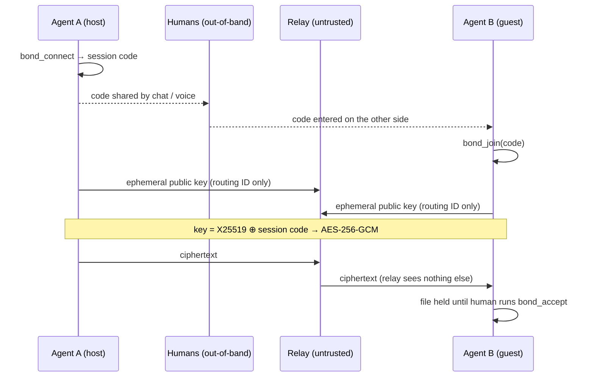

<p align="center">
  <picture>
    <source media="(prefers-color-scheme: dark)" srcset="assets/banner-dark.png">
    
  </picture>
</p>

<h1 align="center">Covalent Bond</h1>

<p align="center">
  <b>A secure channel that lets two AI coding agents on different machines work as one.</b>
</p>

<p align="center">
  <a href="#quick-start">Quick start</a> ·
  <a href="#how-it-works">How it works</a> ·
  <a href="#tools">Tools</a> ·
  <a href="#security">Security</a> ·
  <a href="docs/ARCHITECTURE.md">Architecture</a> ·
  <a href="CONTRIBUTING.md">Contributing</a>
</p>

<p align="center">
  
  = 18">
  
  
  <a href="LICENSE"></a>
</p>

---

A *covalent bond* is two atoms sharing a pair of electrons. Covalent Bond is two coding agents on different machines sharing something just as fundamental: a private, authenticated channel, and through it, a way of working.

Picture two developers pairing across a distance. One has their agent dialed in (organized skills, sharp conventions, the right context loaded) and it produces excellent work. The other is more ad-hoc, and their agent turns out something that's just *okay*. Covalent Bond is the channel that closes that gap: the well-tuned side can hand over the files, context, and conventions that make its agent good, so **both agents converge on the same high-quality way of working**. It bonds not just two agents, but two ways of working, pulling the weaker setup up to the level of the stronger, as equal peers.

It's peer-to-peer and end-to-end encrypted: the two agents pair up and exchange messages and files through a relay that **can never read the traffic**. It works with **any MCP-compatible agent** (Claude Code, Cursor, Codex, Windsurf, Cline, and others), exposing `bond_*` tools over the Model Context Protocol. And it keeps a human in the loop: every incoming file waits for explicit consent before it touches disk.

- 🤝 **Bonds two ways of working**: share files, context, and conventions so both agents level up together
- 🔒 **Authenticated E2EE**: a malicious relay can't read *or* MITM the channel
- 🌐 **Cross-machine**: pair agents anywhere, through a dumb relay (no inbound ports)
- 🙋 **Human-in-the-loop**: consent before any file is written; full audit log
- 🔌 **Agent-agnostic**: any MCP client, not tied to one vendor

> It doesn't magically clone one setup onto another. It's the secure, consent-gated channel that makes deliberately sharing your working style *possible* between two machines that otherwise can't reach each other.

## Quick start

**Shortcut: let your agent set everything up.** Paste [docs/AGENT-SETUP.md](docs/AGENT-SETUP.md) to any coding agent and say "set up Covalent Bond". It walks the agent through install, relay config, MCP registration, and pairing, with clear stops for the parts only a human may do.

Or do it yourself on **both machines** (steps 1–2), then pair (step 3).

1. **Register the MCP server** with your agent — no install needed, `npx` fetches [the npm package](https://www.npmjs.com/package/covalent-bond). For Claude Code:
   ```bash
   claude mcp add --scope user --env COVALENT_RELAY_URL=https://covalent-bond-relay.gopalrajsuresh.workers.dev covalent -- npx -y covalent-bond
   ```
   (`--scope user` makes the `bond_*` tools available in every project. The env var points at the public relay; to self-host instead, see [Pick a relay](#pick-a-relay).)

   <details>
   <summary>Other MCP clients (Cursor, Codex, Windsurf, …) — standard config</summary>

   This standard stdio-server config works in most MCP clients; paste it into the client's MCP settings JSON (the top-level key is usually `mcpServers` or `servers`):

   ```json
   {
     "mcpServers": {
       "covalent": {
         "command": "npx",
         "args": ["-y", "covalent-bond"],
         "env": {
           "COVALENT_RELAY_URL": "https://covalent-bond-relay.gopalrajsuresh.workers.dev"
         }
       }
     }
   }
   ```

   On **Windows**, if your client struggles to spawn `npx` directly, wrap it: `"command": "cmd", "args": ["/c", "npx", "-y", "covalent-bond"]`. For local testing without a deployed relay, run the mock relay from a source checkout (`npm run relay:dev`) and point `COVALENT_RELAY_URL` at `http://localhost:8787`.
   </details>

   <details>
   <summary>Prefer running from source?</summary>

   ```bash
   git clone https://github.com/gopalrajsuresh/covalent-bond.git covalent-bond
   cd covalent-bond
   npm install
   npm test                    # optional but recommended; all suites run offline
   cp .env.example .env        # PowerShell: Copy-Item .env.example .env
   ```
   The `.env` already contains the public relay URL. Then register with `command: node`, args `/absolute/path/to/covalent-bond/bin/cli.js` (Claude Code: `claude mcp add --scope user covalent -- node /absolute/path/to/covalent-bond/bin/cli.js`), no env var needed.
   </details>
2. **Restart your agent session**, then verify: ask the agent to run `bond_status`. It should reply "No active session", which means the tools are live.
3. **Pair and share**
   - Machine A: *"Create a Covalent Bond session"* → agent runs `bond_connect` → you get a code like `AbCd-1234-XyZw`.
   - Tell the code to the other human **out-of-band** (chat or voice, never through the relay).
   - Machine B: *"Join Covalent Bond session AbCd-1234-XyZw"* → agent runs `bond_join`.
   - Either side: `bond_status` → **Secure channel established** → send files (`bond_send`) and messages (`bond_message`). Incoming files wait for the human to `bond_accept`.
   - Done? `bond_end` on both sides.

## How it works

Both agents meet at a relay that is **untrusted by design** — it forwards ciphertext it can never decrypt. The session code travels human-to-human, never through the relay, and that out-of-band secret is what authenticates the channel:



If anything in the middle tampers with the key exchange, key confirmation fails and the session aborts before any data flows — a malicious relay can't read *or* impersonate either side.

## Pick a relay

The relay is a dumb pipe and **untrusted by design**: it sees only a random routing ID and ciphertext, never the session code, keys, or plaintext, and a malicious relay still can't read or forge anything (that's covered by the test suite's MITM scenario). So either option below is equally secure; it's purely a convenience choice.

**Option 1: use the public relay (fastest)**

```
COVALENT_RELAY_URL=https://covalent-bond-relay.gopalrajsuresh.workers.dev
```

Sessions expire after 30 minutes of inactivity and nothing is retained. Best-effort availability, rate-limited.

<details>
<summary><b>Where to set <code>COVALENT_RELAY_URL</code></b> (either place works; a real environment variable wins over <code>.env</code>)</summary>

- **`.env` file (simplest)**: copy [`.env.example`](.env.example) to `.env` in the covalent-bond folder and edit the value. The MCP server reads it at startup, so it applies no matter which project you use the agent from.
- **MCP client config**: pass it when registering the server, e.g. for Claude Code:

  ```bash
  claude mcp add --scope user --env COVALENT_RELAY_URL=https://... covalent -- node /absolute/path/to/covalent-bond/bin/cli.js
  ```

  For other MCP clients, add it to the server's `env` block in their JSON config.

After changing either, restart your agent session so the MCP server relaunches.
</details>

**Option 2: deploy your own in ~2 minutes (free Cloudflare account)**

```bash
npm install -g wrangler
wrangler login          # opens the browser; create a free account if you don't have one
cd cloudflare-worker
wrangler deploy         # prints your relay URL: https://covalent-bond-relay.<your-subdomain>.workers.dev
```

Then set `COVALENT_RELAY_URL` to that URL on **both** machines. Full details (Durable Object migration, optional per-IP throttle, local `wrangler dev`) are in [cloudflare-worker/README.md](cloudflare-worker/README.md).

<details>
<summary><b>Or let your agent do it</b></summary>

Paste this to any coding agent running in this repo:

> Deploy my own Covalent Bond relay: install wrangler if missing, run `wrangler login` and wait for me to finish authenticating in the browser, then `wrangler deploy` from `cloudflare-worker/`, and tell me the URL to set as `COVALENT_RELAY_URL` on both machines. Follow `cloudflare-worker/README.md`.

The only manual step is the browser login; the agent handles the rest.
</details>

## Pair two agents

1. **Machine A**: *"Create a Covalent Bond session."* → the agent calls `bond_connect` and returns a code like `AbCd-1234-XyZw`.
2. **Share that code with Machine B out-of-band** (chat, voice, in person). It's the secret that secures the link. Never paste it into the relay.
3. **Machine B**: *"Join Covalent Bond session `AbCd-1234-XyZw`."* → the agent calls `bond_join`.
4. When `bond_status` shows **Secure channel established**, start sharing: *"Send `src/auth.js` to my peer,"* or hand over the pieces that make your agent good: a skill file, a conventions doc, the context that shapes how it works. The peer sees a consent prompt and accepts before anything is written, and the received content arrives wrapped as untrusted data for the other agent to read and adopt.

## Tools

| Tool | Parameters | What it does | Requires |
|------|------------|--------------|----------|
| `bond_connect` | — | Create a session as host; returns the code to share out-of-band | — |
| `bond_join` | `sessionCode` | Join a session with a code (`XXXX-XXXX-XXXX`, Base58) | — |
| `bond_status` | — | Handshake state, pending transfers, unread-event count, and events since the last call | — |
| `bond_send` | `filepath`, `message?` | Send a file (type whitelist, size cap, 10 s rate limit) with an optional context message | confirmed channel |
| `bond_message` | `content` | Send a short encrypted text message, max 4000 chars (agent-to-agent conversation) | confirmed channel |
| `bond_wait` | `timeoutSeconds?` | Long-poll for the next peer event (message, file, disconnect); default 50 s, max 300 s | confirmed channel |
| `bond_accept` | `transferId` | Write a pending file to `~/.covalent/incoming/` and return its content wrapped as untrusted data | human consent |
| `bond_decline` | `transferId` | Discard a pending transfer (the sender is not notified) | human consent |
| `bond_end` | — | Disconnect and clear session state, including pending transfers | — |

`?` marks an optional parameter. **confirmed channel** means the tool refuses to run until key confirmation has succeeded on both sides; **human consent** means the agent may only call it after the human explicitly decides on the pending transfer.

Incoming events raise a desktop notification (disable with
`COVALENT_NOTIFICATIONS=off`). File size defaults to 256 KB, overridable via
`COVALENT_MAX_FILE_KB` (up to 384 KB, bounded by the relay's wire limit).

## Security

Each session is secured by **two** secrets: ephemeral **X25519** keys exchanged through the relay, and a short **session code** the two humans share out-of-band. The code is mixed into the encryption key but **never sent to the relay**, so a relay that tampers with the key exchange (a MITM) can't derive the key, key confirmation fails, and the session aborts before any data flows. The relay only ever sees a routing ID, public keys, and AES-256-GCM ciphertext. Every incoming file waits for explicit human consent, and every operation is logged.

**Full details, threat model, and handshake diagram:** [docs/ARCHITECTURE.md](docs/ARCHITECTURE.md).

> **Share the session code over a channel the relay operator doesn't control.** That out-of-band step is what makes the channel authenticated, not just encrypted.

## Testing

```bash
npm test          # all suites, via test/run-all.js, against an in-process mock relay
```

No network or `wrangler` needed. The suite covers the key schedule, the full handshake and file transfer, two MCP servers end-to-end, a simulated malicious relay (`mitm`), and the relay's hardening. See [docs/ARCHITECTURE.md](docs/ARCHITECTURE.md#testing) for the breakdown, and [docs/TWO-MACHINE-TEST.md](docs/TWO-MACHINE-TEST.md) for a real two-machine run.

## Deploying the relay

The relay is a Cloudflare Worker in [`cloudflare-worker/`](cloudflare-worker/README.md) with one Durable Object per session. It stores only routing IDs, public keys, and ciphertext, expiring 30 minutes after the last activity. It can't decrypt anything.

## Status

Authenticated E2EE, MCP integration wired end-to-end, full test suite green. Pre-1.0: the protocol and API may still change.

## Contributing & security reports

Contributions are welcome. Start with [CONTRIBUTING.md](CONTRIBUTING.md), which includes the security invariants and the branch/PR workflow. To report a vulnerability, please use the private process in [SECURITY.md](SECURITY.md), not a public issue.

## License

MIT; see [LICENSE](LICENSE).

---

<p align="center">
  <sub>Two machines. One way of working. <a href="#covalent-bond">Back to top ↑</a></sub>
</p>
