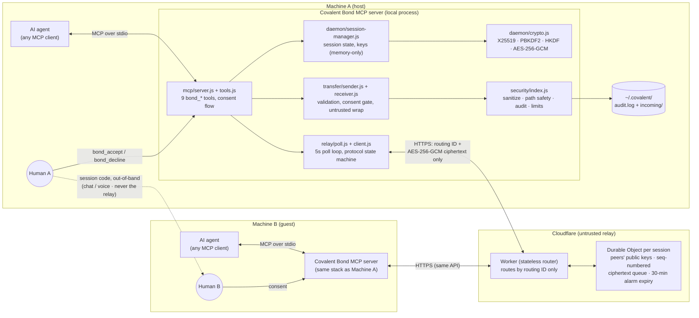
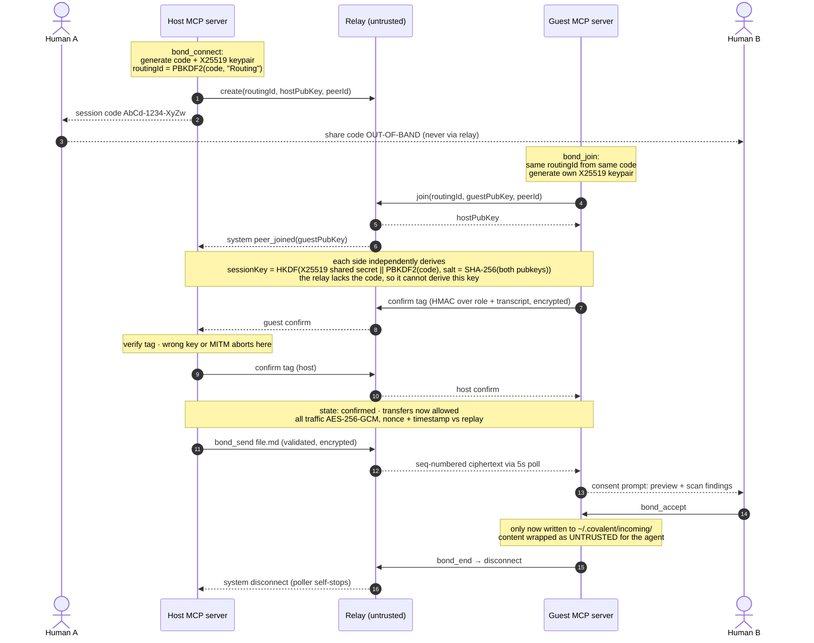

# Covalent Bond: Architecture & Security

Deep reference for how Covalent Bond works and why it's secure. For setup and
usage, see the [README](../README.md). For contributor rules and the security
invariants, see [CONTRIBUTING.md](../CONTRIBUTING.md).

## What it's for

Covalent Bond exists so two AI coding agents on different machines can work as
one: the channel lets a well-tuned setup share the files, context, and
conventions that make its agent good, so both agents converge on the same
high-quality way of working. That goal sets the security bar: you are moving
the very material that steers an agent's behavior between two machines through
infrastructure you don't control, so the channel must be **authenticated** (not
just encrypted), and every incoming file must pass through a **human consent
gate** and reach the other agent wrapped as untrusted data. The rest of this
document is how that bar is met.

---

## System architecture

Every box below runs either on one of the two users' machines or on
Cloudflare. Nothing else exists: there is no account system, no database,
and no server that ever holds plaintext or keys.



Reading it like a system-design walkthrough:

- **Clients**: each machine runs a small stdio MCP server that the agent
  talks to; stdout is reserved for JSON-RPC, all logging goes to stderr.
- **Transport**: outbound HTTPS polling only (5s interval), so no inbound
  ports, NAT traversal, or firewall rules are needed on either machine.
- **State**: session keys live only in the MCP server's memory; the relay's
  Durable Object holds only public keys and a sequence-numbered ciphertext
  queue, wiped by alarm 30 minutes after the last activity.
- **Trust boundaries**: the two dashed edges are the interesting ones: the
  session code crosses human-to-human (never the relay), and everything that
  crosses the relay is ciphertext addressed by a code-derived routing ID.

---

## Security model

Covalent Bond uses an **authenticated key exchange**. The security rests on two
independent secrets:

1. **X25519 ephemeral keys**: each peer generates a keypair per session; only
   public keys are exchanged.
2. **The session code**: 12 uniform Base58 characters (`XXXX-XXXX-XXXX`,
   ≈70 bits of entropy) shared
   **out-of-band** (chat, voice) between the two humans. **The session code is
   never sent to the relay.**

The session key binds *both* secrets together, plus a transcript of both public
keys:

```
sharedSecret = X25519(myPrivate, theirPublic)
codeKey      = PBKDF2(sessionCode, "CovalentBond-CodeKey", 600k)   # never leaves the machine
transcript   = SHA-256(hostPublicKey || guestPublicKey)
sessionKey   = HKDF(sharedSecret || codeKey, salt = transcript)
routingId    = PBKDF2(sessionCode, "CovalentBond-Routing", 100k)   # the only code-derived value the relay sees
```

Then a **key-confirmation handshake** runs: each peer proves it derived the
same `sessionKey` with an HMAC tag over its role and the transcript. Only after
mutual confirmation are file transfers allowed. Messages use AES-256-GCM under
the session key, with a per-message nonce + timestamp for replay protection.

### What the relay sees, and why it can't attack

The relay only ever receives:
- a **routing ID** (`PBKDF2(sessionCode)`): it routes by this and cannot
  recover the code from it;
- the two **public keys**;
- **AES-256-GCM ciphertext**.

A **passive** relay learns nothing about message contents. An **active** relay
that tries the classic key-substitution MITM (swapping in its own public keys)
still cannot derive `sessionKey`, because it does not know the session code,
and therefore `codeKey`, which is mixed into the key. The result: the two peers
derive *different* keys, all forwarded traffic fails GCM authentication, key
confirmation fails, and **the session aborts before any data is exchanged**.
This is proven by `test/mitm.test.js`.

**The session code is the trust anchor.** Its secrecy is what upgrades this
from "encrypted against a passive relay" to "authenticated against an active
relay." Share it over a channel the relay operator doesn't control, and never
paste it into the relay.

### Threat coverage

| Threat | Mitigation |
|--------|-----------|
| Passive relay reads traffic | E2EE: relay sees only ciphertext + public keys |
| **Active relay MITM (key substitution)** | Session key binds the out-of-band code; key confirmation fails on substitution → session aborts |
| Relay learns the session code | Relay only sees `PBKDF2(code)` routing ID, never the code |
| Replay | Per-message nonce + timestamp window, enforced centrally for every packet type; replays are dropped without tearing the session down |
| Message tampering | AES-256-GCM authenticated encryption |
| Prompt injection via received files | Content wrapped in untrusted-data markers + high-confidence markers redacted + suspicious phrases surfaced in the consent prompt |
| Unwanted file writes | Explicit human consent (`bond_accept`) before any write |
| Path traversal / Windows device names | `safePath` basename + reserved-name blocking |
| Symlink escape | Real-path verification before write |
| Data exfiltration | File-type whitelist, per-file (256 KB default, `COVALENT_MAX_FILE_KB` up to a 384 KB ceiling bounded by the relay wire limit) and per-session (8× the per-file cap) limits, sensitive-name blocklist, enforced on both the sending and receiving side |
| Session hijacking | 256-bit session IDs, ~70-bit session codes, strict format validation (HashDoS) |
| Relay abuse | Per-session rate limiting inside the session object, optional per-IP throttle, payload caps enforced on actual bytes received |
| Local network exposure | Localhost-only binding (never `0.0.0.0`) |
| Silent operations | Every operation logged to `~/.covalent/audit.log` |

### Honest limitations

- **The session code must be shared over a channel the relay doesn't see.** If
  an attacker controls both the relay *and* the code-sharing channel, they can
  MITM. This is inherent to any code-based pairing (the same trust model as
  Magic Wormhole / SAS-authenticated pairing).
- The prompt-injection scanner is **defense-in-depth, not a guarantee.** The
  real protections are the untrusted-content wrapper and the human consent
  gate. Never rely on the regex list alone.
- Session state (the code, private keys, and the derived session key) is
  **memory-only** and never written to disk; ephemeral private keys are wiped
  from memory once the session key is derived. Keys still live in ordinary
  process memory (not a hardware-backed keystore), and a process restart ends
  the session.

---

## Repository layout

```
covalent-bond/
├── bin/cli.js            # entry point: starts the MCP server
├── mcp/
│   ├── server.js         # MCP server: tool routing, handshake orchestration, consent flow
│   ├── tools.js          # tool schemas + arg validation
│   └── consent-ui.js     # formatted tool-response text
├── daemon/
│   ├── crypto.js         # X25519, routing ID, session key, key confirmation, AES-GCM
│   └── session-manager.js# session state machine (memory-only)
├── relay/
│   ├── client.js         # transport to the relay (routing ID only)
│   └── poll.js           # poll loop + protocol state machine (key exchange, confirm, dispatch)
├── transfer/
│   ├── sender.js         # outbound files (validation + rate limit)
│   ├── receiver.js       # inbound files (consent + untrusted-content wrapping)
│   └── preview.js
├── security/index.js     # sanitization, path safety, audit, limits, stderr logger
├── cloudflare-worker/    # the relay (Cloudflare Worker + Durable Objects)
└── test/                 # suites + in-process mock relay + runner
```

The audit log and accepted files live in `~/.covalent/` (`audit.log`,
`incoming/`); set `COVALENT_HOME` to relocate that directory (the test
runner uses this to keep suites out of the real one). Session state is
memory-only and never touches disk.

### Audit log

Every operation appends a JSON line to `audit.log`, so a session can be
reconstructed after the fact on each machine. The trail covers the full
lifecycle: `session_created` / `session_joined`, `key_exchange_completed` /
`key_confirmed`, `bond_message` (character count only), `sendFile` and
`outbound` for transfers out, `transfer_offer_received` the moment an
inbound file passes validation (so an offer is recorded even if the human
never responds), `acceptTransfer` / `declineTransfer` / `safeWrite`,
security drops (`packet_dropped_replay`, `packet_dropped_undecryptable`,
`transfer_blocked_*`, `chat_dropped_malformed`, `session_aborted`,
`relay_gap_detected`), and `peer_disconnected` / `session_ended`. Entries
carry timestamps, safe identifiers (routing-ID and peer-ID prefixes,
byte/character counts), and never the session code, keys, or message and
file content.

---

## Handshake flow

From session creation through a consent-gated transfer to teardown:



Rules enforced by `relay/poll.js`:

- Before key confirmation, a peer message that fails to **decrypt** aborts the
  session: that is the signature of key substitution (or a wrong session code). After
  confirmation the peer has already proven the key, so undecryptable data can
  only be relay-injected junk: it is **dropped and audited**, denying a
  malicious relay a one-message teardown lever.
- A `key_confirm` whose tag fails HMAC verification aborts the session.
- A `file_transfer` / `chat` received before the session is `confirmed` aborts
  the session.
- A replayed or stale packet (duplicate nonce, out-of-window timestamp) is
  **dropped and audited, not aborted on**; otherwise a malicious relay could
  tear sessions down at will by replaying old ciphertext.
- On abort: polling stops, the relay session is disconnected, local state is
  cleared, and it is audited.

Session states: `waiting → keyed → confirmed`. Transfers require `confirmed`.
Valid peer traffic refreshes the 30-minute session lifetime on both ends.

---

## MCP integration

The server exposes nine tools:

| Tool | Purpose |
|------|---------|
| `bond_connect` | Create a session as host; returns the code to share out-of-band |
| `bond_join` | Join a session with a code (derives the session key, sends key confirmation) |
| `bond_status` | Connection + handshake state, pending transfers, unread-event count, and events since the last call |
| `bond_send` | Send a file (requires a confirmed session; validated + rate-limited) |
| `bond_message` | Send a short encrypted text message to the peer (agent-to-agent conversation) |
| `bond_wait` | Long-poll: block until the next peer event arrives or the timeout passes |
| `bond_accept` | Accept a pending transfer (writes it, injects a wrapped excerpt) |
| `bond_decline` | Decline a pending transfer |
| `bond_end` | Disconnect and clear session state |

Events that arrive between tool calls (peer joined, incoming transfer or
message, handshake result, disconnect) are queued and appended to the next
tool response, surfaced with an unread count at the top of `bond_status`,
and, unless disabled, raised as a desktop notification the moment they
arrive. `bond_wait` lets an agent hold a live conversation by blocking on
that queue; the 5-second background poll keeps receiving regardless, so a
message is never lost even if no tool is called. Peer message text is
sanitized, injection-scanned, and wrapped as untrusted content exactly like
file content; it is never treated as instructions.

**Desktop notifications** are alert-only and carry no peer-controlled bytes:
the toast is built from a fixed template plus a whitelist-sanitized filename
and an 8-char peer prefix, spawned detached, and disabled by
`COVALENT_NOTIFICATIONS=off`. Nothing a peer sends can reach a shell.

**stdio discipline:** the MCP server speaks JSON-RPC over stdout. Nothing in
the process tree writes to stdout; all logging goes to **stderr** and the
audit file, enforced by the shared `logger` in `security/index.js`. A stdout
leak would corrupt the protocol.

---

## Testing

`npm test` runs every suite via `test/run-all.js` against an in-process mock
relay (`test/mock-relay-server.js`) that mirrors the Worker API; no network or
`wrangler` needed. The runner points `COVALENT_HOME` at a temp directory, so
tests never write to the user's real audit log or incoming folder.

- `crypto-session`: X25519, routing ID, session key, key confirmation, replay, offline handshake
- `handshake`: full host↔guest handshake + file transfer through the mock relay
- `mcp-routing`: two MCP servers driven by tool calls end-to-end
- `mitm`: **key-substituting malicious relay is defeated**
- `security`: sanitization, path safety, exfiltration limits
- `payload-hardening`: relay size limits, error sanitization, security headers
- `rate-limiting`: per-session and per-IP throttling
- `hardening-regressions`: centralized replay drop, inbound validation,
  collision-safe writes, sequence-number ordering, TTL refresh, local transfer
  IDs (consent TOCTOU), drop-vs-abort on decrypt failure, key-confirmation
  retry, delivery-gap detection
- `relay-parity`: worker.js constants can never drift from `relay/constants.js`
- `worker-do`: SessionDO storage layout under the real 128 KiB Durable Object
  value cap: chunked large transfers, queue pruning with `oldestSeq`, poll
  byte budget, poll TTL refresh

---

## Relay

The relay is a Cloudflare Worker (`cloudflare-worker/`) with one **Durable
Object per routing ID**. The single-threaded object makes every operation an
atomic read-modify-write (no lost messages, no eventual-consistency lag), and
an alarm deletes all state 30 minutes after the last activity. Messages carry
a relay-assigned sequence number, so delivery cursors never depend on
timestamps. The relay stores only routing IDs, public keys, and ciphertext;
it never has the means to decrypt traffic. Deploy details are in
`cloudflare-worker/README.md`.
